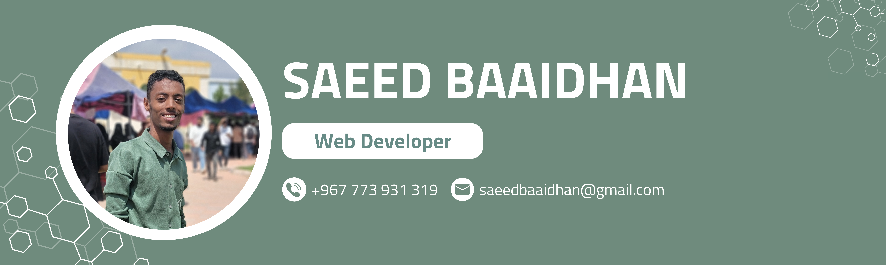

# SSB2002S 👋

🚀 Hi, I’m Saeed Baaidhan, a freshly graduated Front‑End Developer (Class of 2025) passionate about crafting interactive, responsive, and user‑friendly web experiences. With solid skills in HTML, CSS, JavaScript, Bootstrap, React, Tailwind CSS, Redux Toolkit, and Axios, I specialize in turning modern design concepts into seamless, cross‑device interfaces. Driven by a love for clean, maintainable code and continuous learning, I strive to deliver top‑quality solutions that delight users and empower businesses.

## 🛠️ Tech Stack

**Languages & Tools I Work With:**

---

## 💼 Featured Projects

| Project                                                                                                 | Description                                                                                                     | Technologies                                              |
| ------------------------------------------------------------------------------------------------------- | --------------------------------------------------------------------------------------------------------------- | --------------------------------------------------------- |
| [Educational Website With React](https://ssb2002s.github.io/Educational-Website-With-React/)            | A responsive educational website built with React to showcase course materials and interactive components.      | React, HTML, CSS, FontAwesome, Tailwind CSS               |
| [To-Do List Using React-Redux Toolkit](https://ssb2002s.github.io/To-Do-List-Using-React-ReduxToolkit/) | A feature-rich to-do list app demonstrating state management with Redux Toolkit and asynchronous data fetching. | React, HTML, CSS, FontAwesome, Redux Toolkit, Sweetalert2 |
| [Product Management System](https://ssb2002s.github.io/Product-Managment-System/)                       | A simple product management system.                                                                             | HTML, CSS, JavaScript, Sweetalert2, Fontawesome           |

---

## 📊 GitHub Stats

---

## ❤️ Interests

* Front-End development and modern UI/UX design
* Building responsive, fast, and accessible websites
* Turning creative designs into functional interfaces
* Constantly learning and keeping up with front-end trends

---

## 📫 Contact Me

